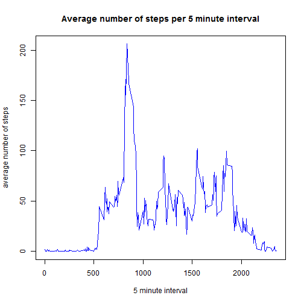

# Reproducible Research: Peer Assessment 1


```r
library(reshape2)
library(lattice)
```

```
## Warning: package 'lattice' was built under R version 3.0.3
```


## Loading and preprocessing the data
We first load the activity data into R and convert the data variable to Date type

```r
## Read activity data into R
activity <- read.csv("activity.csv", stringsAsFactors = FALSE)
## convert date variable to Date type
activity$date <- as.Date(activity$date, format = "%Y-%m-%d")
```


## What is mean total number of steps taken per day?
In order to make the histogram and determine mean and median number of steps per day we melt the data.  
Data is melted to a unique combination of date and the value of steps per row. Missing values are omitted.  
Thereafter we calculate the sum of the steps per day.

```r
## melt dataset (each row unique combination of date and the value of steps)
data_melt <- na.omit(melt(activity[, 1:2], id = c("date")))
## calculate the sum of each day
total_steps <- dcast(data_melt, date ~ variable, sum, na.rm = TRUE)
```

Now we're ready to make the plot and calculate the mean and median. The resulting histogram:

```r
## make histogram of total steps per day
hist(total_steps$steps, xlab = "number of steps per day", main = "Total number of steps per day", 
    col = "blue")
```

 


```r
## calculate mean and median steps per day
mean_steps_d <- mean(total_steps$steps)
median_steps_d <- median(total_steps$steps)
```

The mean total number of steps taken per day is 1.0766 &times; 10<sup>4</sup> and the median number is 10765

## What is the average daily activity pattern?
To determine the average daily activity pattern we melt the data by 5 minute interval and calculate the average number of steps per interval. The method is similar to above.

```r
## melt data (each row unique combination of 5 min interval and the value of
## steps)
data_melt2 <- na.omit(melt(activity[, c(1, 3)], id = c("interval")))
## calculate average # steps for each 5 minute interval
avg_steps <- dcast(data_melt2, interval ~ variable, mean, na.rm = TRUE)
```

Now we're ready to make the plot and calculate the interval that contains the maximum number of steps.
The resulting time series plot:

```r
## make time series plot of average steps per 5 minute interval
plot(avg_steps$interval, avg_steps$steps, type = "l", xlab = "5 minute interval", 
    ylab = "average number of steps", main = "Average number of steps per 5 minute interval", 
    col = "blue")
```

 


```r
intv_max_avg_start <- avg_steps[avg_steps$steps == max(avg_steps$steps), "interval"]
intv_max_avg_end <- intv_max_avg_start + 4
```

The 5-minute interval with on average the maximum number of steps across all days is the interval that starts on 835 and ends on 839 minutes.

## Imputing missing values
The steps column contains missing values. When a missing value occurs the whole day has missing values.  
This can be seen in the following table:

```r
table(activity$date, is.na(activity$steps))
```

```
##             
##              FALSE TRUE
##   2012-10-01     0  288
##   2012-10-02   288    0
##   2012-10-03   288    0
##   2012-10-04   288    0
##   2012-10-05   288    0
##   2012-10-06   288    0
##   2012-10-07   288    0
##   2012-10-08     0  288
##   2012-10-09   288    0
##   2012-10-10   288    0
##   2012-10-11   288    0
##   2012-10-12   288    0
##   2012-10-13   288    0
##   2012-10-14   288    0
##   2012-10-15   288    0
##   2012-10-16   288    0
##   2012-10-17   288    0
##   2012-10-18   288    0
##   2012-10-19   288    0
##   2012-10-20   288    0
##   2012-10-21   288    0
##   2012-10-22   288    0
##   2012-10-23   288    0
##   2012-10-24   288    0
##   2012-10-25   288    0
##   2012-10-26   288    0
##   2012-10-27   288    0
##   2012-10-28   288    0
##   2012-10-29   288    0
##   2012-10-30   288    0
##   2012-10-31   288    0
##   2012-11-01     0  288
##   2012-11-02   288    0
##   2012-11-03   288    0
##   2012-11-04     0  288
##   2012-11-05   288    0
##   2012-11-06   288    0
##   2012-11-07   288    0
##   2012-11-08   288    0
##   2012-11-09     0  288
##   2012-11-10     0  288
##   2012-11-11   288    0
##   2012-11-12   288    0
##   2012-11-13   288    0
##   2012-11-14     0  288
##   2012-11-15   288    0
##   2012-11-16   288    0
##   2012-11-17   288    0
##   2012-11-18   288    0
##   2012-11-19   288    0
##   2012-11-20   288    0
##   2012-11-21   288    0
##   2012-11-22   288    0
##   2012-11-23   288    0
##   2012-11-24   288    0
##   2012-11-25   288    0
##   2012-11-26   288    0
##   2012-11-27   288    0
##   2012-11-28   288    0
##   2012-11-29   288    0
##   2012-11-30     0  288
```

We determine the total number missing values by using complete.cases and replace the missing values by the average number of steps per 5 minute interval.

```r
missval <- sum(!complete.cases(activity$steps))
## join original activity data with avg. steps per 5 min interval
activity2 <- merge(activity, avg_steps, by = "interval", all.x = TRUE)
## assign original steps value
activity2$steps <- activity2$steps.x
## replace missing values by 5 minute interval avg
activity2[is.na(activity2$steps), "steps"] <- activity2[is.na(activity2$steps), 
    "steps.y"]
## reset column order, preserve original vars
activity2 <- activity2[, c("steps", "date", "interval")]
```

The number of rows with missing values is 2304.  
The resulting dataset is named ´activity2´.    
We remake the histogram, recalculate the mean and median based on this new dataset and compare this to what we found earlier.

```r
## melt dataset (each row unique combination of date and the value of steps)
data_melt2 <- melt(activity2[, 1:2], id = c("date"))
## calculate the sum of each day
total_steps2 <- dcast(data_melt2, date ~ variable, sum)
```

The resulting histogram:

```r
## make histogram of total steps per day
hist(total_steps2$steps, xlab = "#steps per day", main = "Total number of steps per day", 
    col = "red")
```

 


```r
## calculate mean and median steps per day
mean_steps_d2 <- mean(total_steps2$steps)
median_steps_d2 <- median(total_steps2$steps)
diff_mean <- mean(total_steps2$steps) - mean(total_steps$steps)
diff_median <- median(total_steps2$steps) - median(total_steps$steps)
```

The mean and median total number of steps taken per day when missing values are imputed:  
* Mean:1.0766 &times; 10<sup>4</sup> (before impute 1.0766 &times; 10<sup>4</sup>, difference is 0)
* Median: 1.0766 &times; 10<sup>4</sup> (before impute 10765, difference is 1.1887)

The mean doesn´t differ, the median changes to the mean value.  
In this case this is due to the fact that if missing values occur, it is for the whole day. The boxplot underneath shows the decline in variance.

```r
## make boxplot comparison of total steps per day
par(mfrow = c(1, 2))
boxplot(total_steps$steps, data = total_steps, col = "blue", main = "Without missing values")
boxplot(total_steps2$steps, data = total_steps2, col = "red", main = "After imputing missing values")
```

 


## Are there differences in activity patterns between weekdays and weekends?
First we add a factor variable that indicates weekday or weekend.

```r
activity2$week_split <- as.factor(ifelse(weekdays(activity2$date) %in% c("Saturday", 
    "Sunday"), "weekend", "weekday"))
```

Then we melt the data and calculate the average number of steps of the 5 minute interval per weekday/weekend.

```r
## melt data (each row unique combination of 5 min interval, weekend/weekday
## and the value of steps)
data_melt3 <- melt(activity2[, c(1, 3, 4)], id = c("interval", "week_split"))
## calculate average # steps for each 5 minute interval for weekday/weekend
## split
avg_steps2 <- dcast(data_melt3, interval + week_split ~ variable, mean, na.rm = TRUE)
```

Now we're ready to make the plot. The resulting time series plot:

```r
## make time series plot of average steps per 5 minute interval
xyplot(avg_steps2$steps ~ avg_steps2$interval | week_split, data = avg_steps2, 
    type = "l", xlab = "5 minute interval", ylab = "average number of steps", 
    main = "Average number of steps per 5 minute interval", layout = c(1, 2))
```

 

